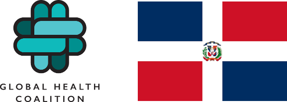

# Bahmni GHC distribution

_A community health clinic distribution to support standardized terminology, clinical processes, and reporting analytics at the mobile clinic of GHC de Macoris, Dominican Republic_

-----

This repository maintains the 'distro POM' for Global Health Coalition's Bahmni distribution shared across multiple implementations.
It downloads and brings in one place all artifacts needed by the distribution, simply run:
```
mvn clean package
```
### Target inventory:

* `bahmni_emr/`
<br/>The target version of the front-end apps that makes 'Bahmni EMR'.
* `bahmni_config/`
<br/>The bespoke Bahmni configuration (more [here](https://github.com/globalhealthcoalition/bahmni-config-ghc)) to be consumed by Bahmni Apps.
* `openmrs_modules/`
<br/>The required set of OpenMRS modules.
* `openmrs_config/`
<br/>The OpenMRS bespoke configuration (more [here](https://github.com/globalhealthcoalition/openmrs-config-ghc)) to be processed by the [Initializer module](https://github.com/mekomsolutions/openmrs-module-initializer).
* `openmrs_core/`
The target version of OpenMRS Core.

## Release Notes

### Version 2.4.1
* Added missing 'Wrist/Hand/Finger' to Surgery Priorities

### Version 2.4.0
* Updated Bahmni IE Apps version.
* Added New Medications.
* Arranged appointments services alphabetically.
* Added units and changed names to TFTs + added decimal points for all lab results.
* Fixed previous not showing lab results.
* Added Blood glucose to dashboard.
* Added numbers for clinical urgency level.
* Enhanced vitals widget to show up to 3 previous visit.